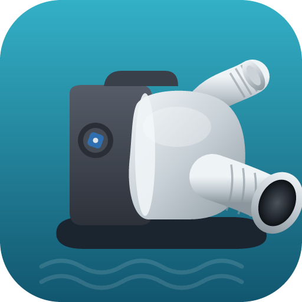
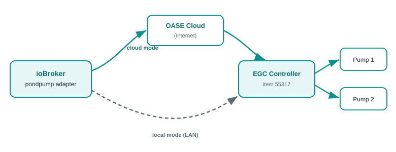
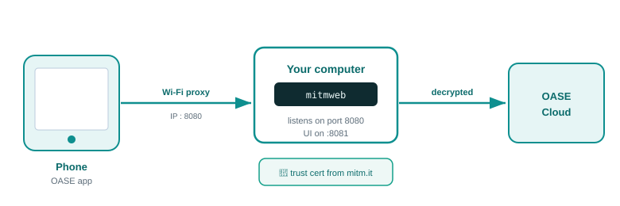

<div class="cover">
  
  <h1>ioBroker.pondpump</h1>
  <p class="subtitle">Handbuch — OASE AquaMax Eco Titanium Teichpumpen in ioBroker einrichten, steuern und überwachen</p>
  <div class="badge">🐟 Einsteigerfreundliche Anleitung</div>
</div>

## 1. Was der Adapter macht

<figure>
  
  <figcaption>Wie ioBroker deine Pumpen erreicht: heute über die OASE-Cloud und — im lokalen Modus — direkt über dein LAN.</figcaption>
</figure>

Der **pondpump**-Adapter verbindet ioBroker mit deiner/deinen **OASE AquaMax Eco Titanium**
Teichpumpe(n) über das Gateway **OASE Garden Controller Cloud (EGC)**. Sobald er läuft, kannst du
aus ioBroker heraus (und damit aus VIS, Skripten, Szenen, Alexa usw.):

- **jede Pumpe ein- und ausschalten**,
- die **Pumpendrehzahl** von 0 – 100 % einstellen,
- **Live-Telemetrie** lesen: Leistung (W), Motordrehzahl (U/min), Temperatur (°C) und
  Netzspannung (V),
- den **Verbindungs- und Gerätestatus** sehen.

Jede Pumpe behält den Namen, den du ihr in der OASE-App gegeben hast (z. B. *Wasserfall*,
*Filter*), damit du sie im Objektbaum wiedererkennst.

> **Gut zu wissen:** Der Adapter spricht mit dem **Controller** (Artikel 55317), der wiederum mit den
> Pumpen (Artikel 73656) kommuniziert. Er ist ein eigenständiges Projekt, unabhängig vom
> Community-Adapter für die OASE-Steckdosen-Controller — er zielt auf die smarten Teichpumpen.

---

## 2. Bevor du startest — was du brauchst

| Du brauchst | Wofür |
| --- | --- |
| Eine laufende **ioBroker**-Installation (js-controller, Node.js ≥ 22) | Die Plattform, auf der der Adapter läuft |
| Einen **OASE Garden Controller Cloud** (EGC, Artikel 55317), in der OASE-App eingerichtet | Das Gateway, mit dem sich der Adapter verbindet |
| Eine oder zwei **OASE AquaMax Eco Titanium** Pumpen (Artikel 73656), in der App gekoppelt | Die gesteuerten Geräte |
| Deine Pumpen laufen **bereits in der OASE-App** | Der Adapter nutzt denselben Cloud-Account |
| Ein **Cloud-Refresh-Token** (siehe Kapitel 4) | Damit sich der Adapter ohne dein Passwort anmeldet |

> **Tipp:** Bring zuerst alles in der **OASE-App** zum Laufen. Wenn die App die Pumpen schalten kann,
> kann es der Adapter auch.

---

## 3. Adapter installieren

Der Adapter ist auf npm als **`iobroker.pondpump`** veröffentlicht. Solange er noch nicht Teil des
offiziellen ioBroker-Repositories ist, installierst du ihn aus der Quelle:

1. Öffne die ioBroker-**Admin**-Oberfläche.
2. Gehe zu **Adapter** und schalte den **Experten-Modus** ein (Zauberhut-Symbol oben rechts).
3. Klicke auf das Symbol **„Aus eigener URL installieren"** (Katze/Octocat).
4. Gib eines davon ein:
   - den npm-Paketnamen **`iobroker.pondpump`** oder
   - die GitHub-URL eines Release-Tarballs, falls du eine erhalten hast.
5. Bestätige und warte, bis der Adapter in der Liste erscheint.
6. Klicke auf das **+** auf der pondpump-Kachel, um eine **Instanz** anzulegen (`pondpump.0`).

Die Instanz-Konfiguration öffnet sich automatisch. Lass sie kurz offen — zuerst brauchen wir einen
Refresh-Token (nächstes Kapitel).

---

## 4. Cloud-Refresh-Token beschaffen (Schritt für Schritt mit mitmproxy)

Die OASE-Cloud nutzt **Microsoft Azure AD B2C** zur Anmeldung. Aus Sicherheitsgründen speichert der
Adapter dein Kontopasswort **nicht**. Stattdessen verwendet er einen **Refresh-Token** — eine lange,
einmalige Anmeldeinformation, die deine OASE-App beim Login erhält. Diesen Token fängst du **einmal**
mit einem kleinen Werkzeug namens **mitmproxy** ab, trägst ihn in den Adapter ein, und danach erneuert
der Adapter ihn automatisch.

Keine Sorge, falls du so etwas noch nie gemacht hast — folge einfach den Schritten genau.

<figure>
  
  <figcaption>mitmproxy sitzt zwischen deinem Smartphone und der OASE-Cloud, sodass du den Login mitlesen und den Token kopieren kannst.</figcaption>
</figure>

### 4.1 mitmproxy installieren und starten

mitmproxy ist ein kleines, kostenloses Programm. Wir nutzen seine Browser-Variante **mitmweb**. Folge
den Schritten für **dein** Betriebssystem.

#### Windows (mit PowerShell)

1. Öffne deinen Webbrowser und gehe auf **<https://mitmproxy.org/downloads/>**.
2. Lade das **Windows**-Paket herunter (die neueste Version — meist ein **`.msi`**-Installer).
3. Öffne die heruntergeladene Datei und klicke dich durch den Installer: **Weiter → Weiter →
   Installieren → Fertig**.
4. Öffne nun **PowerShell**:
   - Drücke die **Windows-Taste**, tippe **`PowerShell`** und klicke in der Liste auf **Windows
     PowerShell**.
   - Es erscheint ein dunkles Fenster mit blinkendem Cursor — das ist die Kommandozeile.
5. Tippe diesen Befehl ein und drücke **Enter**:

   ```powershell
   mitmweb
   ```

6. Fragt Windows nach dem **Netzwerkzugriff**, klicke **Zulassen**. Dein Browser öffnet einen neuen
   Tab unter **<http://127.0.0.1:8081>** — das ist das mitmproxy-Bedienfeld. mitmproxy wartet nun auf
   **Port 8080** auf den Smartphone-Datenverkehr. ✅
7. **Lass dieses PowerShell-Fenster die ganze Zeit offen** — schließt du es, stoppt mitmproxy. Zum
   Beenden später ins Fenster klicken und **Strg + C** drücken.

> **„mitmweb wird nicht erkannt"?** Schließe PowerShell und öffne es erneut (damit es das neu
> installierte Programm bemerkt). Hast du stattdessen die **`.zip`**-Variante geladen, entpacke sie,
> tippe dann in PowerShell `cd ` gefolgt vom Ordnerpfad und starte **`.\mitmweb.exe`**.

#### macOS

1. Öffne das **Terminal** (**Cmd + Leertaste**, **`Terminal`** tippen, Enter).
2. Am einfachsten mit [Homebrew](https://brew.sh): `brew install mitmproxy`. (Kein Homebrew? Lade die
   macOS-Version von **<https://mitmproxy.org/downloads/>** und entpacke sie.)
3. Starte **`mitmweb`**. Ein Browser-Tab öffnet sich unter **<http://127.0.0.1:8081>**.

#### Linux

1. Installiere es mit **`pipx install mitmproxy`** (oder über das Paket deiner Distribution bzw. die
   Binaries von der Download-Seite).
2. Starte **`mitmweb`** in einem Terminal und öffne **<http://127.0.0.1:8081>**.

In jedem Fall gilt: Die Browser-Seite auf **:8081** ist das Bedienfeld, das du beobachtest, und über
**Port 8080** schickt gleich dein Smartphone seinen Datenverkehr (nächster Schritt).

### 4.2 Den Smartphone-Verkehr über mitmproxy leiten

Smartphone und Rechner müssen im **selben WLAN** sein.

1. Ermittle die **lokale IP deines Rechners** (z. B. `192.168.1.20`): Windows `ipconfig`,
   macOS/Linux `ip addr` / `ifconfig`.
2. Am Smartphone: **WLAN-Einstellungen → dein Netzwerk → Proxy → Manuell** und trage ein:
   **Server = IP deines Rechners**, **Port = 8080**. Speichern.
3. Öffne den Browser am Smartphone und rufe **<http://mitm.it>** auf. Wähle dein Handy-System,
   **installiere** das angebotene Zertifikat **und vertraue ihm**:
   - **iOS:** Profil installieren, dann *Einstellungen → Allgemein → Info → Zertifikatsvertrauen* und
     das mitmproxy-Zertifikat **einschalten**.
   - **Android:** als **CA-Zertifikat** installieren (Einstellungen → Sicherheit → Verschlüsselung &
     Anmeldedaten → Zertifikat installieren → CA-Zertifikat).

   Dieses Zertifikat ist der Schlüssel, mit dem mitmproxy den sonst verschlüsselten OASE-Verkehr lesen
   kann. **Entferne den Proxy und das Zertifikat danach wieder.**

### 4.3 Login mitschneiden und den Refresh-Token holen

1. Leere in der **mitmweb**-Seite die Liste (damit neue Anfragen leicht zu finden sind).
2. In der **OASE-App**: **abmelden**, dann **wieder anmelden**.
3. Tippe im **Filterfeld** oben in mitmweb einen dieser Filter ein — das ist der Trick, mit dem du
   dir das Scrollen durch Hunderte Einträge sparst:

   | Diesen Filter eingeben | Zeigt |
   | --- | --- |
   | `~u token` | nur Anfragen, deren URL „token" enthält |
   | `~d account.oase.com` | nur Anfragen an den OASE-Login-Server |
   | `~b refresh_token` | nur Anfragen, deren Body `refresh_token` enthält |

4. Klicke die **POST**-Anfrage an, die auf **`/oauth2/v2.0/token`** endet.
5. Öffne den Reiter **Request** und sieh dir den Formular-Body an. Suche **`refresh_token=`** und
   kopiere den langen Wert dahinter (bis zum nächsten `&`).
   - **Zusatz-Tipp:** Drücke in mitmweb **`/`** und suche nach `refresh_token`, um es sofort
     hervorzuheben.
6. Trage diesen Wert in die Adapter-Einstellung **„Cloud-Refresh-Token"** ein (Kapitel 5).

> Der Refresh-Token ist lang (mehrere hundert Zeichen) — kopiere ihn **vollständig**. Behandle ihn
> wie ein Passwort: nicht weitergeben. Du kannst ihn jederzeit widerrufen, indem du dich in der
> OASE-App überall abmeldest. **Dein Kontopasswort wird nie in den Adapter eingegeben.**

### 4.4 (Fortgeschritten) Gerätepasswort für den lokalen Modus finden

Nur nötig, wenn du den Verbindungsmodus **`local`** möchtest (Kapitel 8). Während
mitmproxy noch läuft:

1. Öffne in der App deinen Teich, damit die Pumpen geladen werden (das löst den Inventar-Download
   aus).
2. Tippe im Filterfeld von mitmweb **`~u Inventory`** ein, um die Anfrage an **`/User/Inventory`**
   anzuzeigen.
3. Klicke sie an und öffne den Reiter **Response**. Suche im JSON die **Custom-Attribute** der Pumpe;
   der Eintrag mit **`Id` = 101** enthält das **Gerätepasswort** — ein **64-stelliger** Wert (er kann
   `\uXXXX`-Escape-Sequenzen enthalten, das ist in Ordnung).
4. Kopiere diesen Wert in die Adapter-Einstellung **„Gerätepasswort"**. Der Adapter dekodiert ihn und
   nutzt ihn für den lokalen TLS-Handshake.

> **Falls mitm.it nicht lädt:** Prüfe, ob der Proxy des Smartphones auf die IP deines Rechners und
> Port 8080 zeigt und ob Datenverkehr fließt. Bei iOS musst du das Zertifikat sowohl **installieren**
> als auch **ihm vertrauen** (zwei getrennte Schritte).

---

## 5. Instanz konfigurieren

Öffne **Instanzen → pondpump.0 → Einstellungen** (Schraubenschlüssel-Symbol). Die Einstellungen sind
gruppiert:

### Verbindung

| Einstellung | Was du einträgst |
| --- | --- |
| **Verbindungsmodus** | `cloud` für den Internet-Weg, `local` für den hausinternen LAN-Weg (Kapitel 8). Die beiden schließen sich gegenseitig aus. |
| **Abfrageintervall** | Wie oft (Sekunden) der Adapter den Status liest. Standard **30**. Minimum 5. |

### Cloud

| Einstellung | Was du einträgst |
| --- | --- |
| **Cloud-Refresh-Token** | Der Token aus Kapitel 4 (verschlüsselt gespeichert). |
| *Erweitert (Base-URL, Token-URL, Client-ID, Scope)* | Standardwerte belassen, außer OASE ändert die Cloud. |

### Lokal (nur für `local`)

| Einstellung | Was du einträgst |
| --- | --- |
| **Controller-IP** | Die Adresse des EGC-Controllers in deinem Netzwerk. |
| **Gerätepasswort** | Das 64-stellige Gerätepasswort (fortgeschritten; siehe Kapitel 8). |
| **Bind-Adresse / Port** | Adresse des ioBroker-Hosts und TCP-Port, zu dem sich der Controller zurückverbindet (Standard 5999). |

Klicke auf **Speichern**. Die Instanz startet und nach wenigen Sekunden sollte **`info.connection`**
auf **true** springen.

---

## 6. Die Objekte, die der Adapter anlegt

Nach der ersten erfolgreichen Abfrage findest du unter **`pondpump.0`**:

```
pondpump.0
├── info.connection            (true bei Verbindung)
├── <gateway>                  der EGC-Controller (device)
│   ├── serialNumber, firmware
│   └── online                 (Controller erreichbar)
└── pumps.<deviceNumber>       ein device je Pumpe, benannt wie in der App
    ├── control.on             ← ein/aus                (schreibbar)
    ├── control.speed          ← Drehzahl 0–100 %       (schreibbar)
    ├── control.speedRaw       ← Drehzahl 0–255 (roh)   (schreibbar)
    ├── status.connected       Pumpe erreichbar
    ├── status.fcStatus        Statustext des Controllers
    └── telemetry
        ├── power              Live-Leistung in W
        ├── speed              Live-Motordrehzahl in U/min
        ├── temperature        °C
        ├── temperature2       °C (zweiter Sensor)
        ├── voltage            Netzspannung in V
        └── raw.sensorN        noch nicht zugeordnete Sensorwerte
```

---

## 7. Pumpen steuern und auslesen

**Pumpe ein-/ausschalten** — setze `pumps.<deviceNumber>.control.on` auf `true` / `false`.

**Drehzahl einstellen** — schreibe einen Prozentwert (0–100) nach
`pumps.<deviceNumber>.control.speed`. Der Adapter sendet den Befehl, bestätigt ihn und liest die
Pumpe kurz darauf erneut, sodass die Zustände die Realität widerspiegeln.

**Telemetrie lesen** — die Werte unter `telemetry` aktualisieren sich live bei jeder Abfrage
(schnelle Werte wie Leistung und Drehzahl in jedem Zyklus, langsamere wie Temperatur nur alle paar
Zyklen, um die Cloud zu schonen). Nutze sie in VIS, in Diagrammen oder in Skripten.

Beispiel (JavaScript-Adapter):

```javascript
// Pumpe "Wasserfall" auf 70 % laufen lassen
setState('pondpump.0.pumps.1234567.control.speed', 70);

// Ihre Live-Leistung protokollieren
on('pondpump.0.pumps.1234567.telemetry.power', (obj) => {
    log('Pumpenleistung: ' + obj.state.val + ' W');
});
```

---

## 8. Lokaler Modus (hausinternes LAN)

Der Adapter kann **komplett über dein lokales Netzwerk** laufen, ohne Internet. Stelle den
**Verbindungsmodus** auf **`local`**, dann:

- startet ioBroker einen kleinen **TLS-Server** und sendet ein **UDP-Weck**-Paket an den Controller,
- der Controller **verbindet sich zurück** über TLS und authentifiziert mit dem **Gerätepasswort**,
- danach liest der Adapter Gateway + Pumpen, pollt **Live-Telemetrie** (Leistung, Drehzahl,
  Temperatur, Spannung) und lässt dich **ein-/ausschalten und die Drehzahl setzen** — alles über LAN.

**Was du brauchst:**

- **Controller-IP** — die Adresse des EGC-Controllers in deinem Netzwerk.
- **Gerätepasswort** — der 64-stellige Wert (wie du ihn ausliest, steht in Kapitel 4.4).
- einen offenen Netzwerkpfad: **UDP 5959** hinaus zum Controller und **TCP 5999** zurück zu ioBroker.
  Liegen Controller und ioBroker in unterschiedlichen Subnetzen/VLANs, gib diese zwei Richtungen frei.

Lass die **Bind-Adresse** auf `0.0.0.0` — der Adapter ermittelt automatisch die Host-Adresse, zu der
der Controller sich zurückverbinden soll.

> **Hinweis:** Der aktuelle **Drehzahl-Sollwert** (der %-Wert) wird über den lokalen Kanal nicht
> zurückgelesen — der State `control.speed` zeigt den zuletzt in ioBroker gesetzten Wert. **An/Aus
> wird live gelesen** (aus der Leistungsaufnahme der Pumpe) und spiegelt damit auch Änderungen aus
> der OASE-App.

---

## 9. Fehlerbehebung

| Symptom | Was zu prüfen ist |
| --- | --- |
| `info.connection` bleibt **false** | Ist ein **Refresh-Token** eingetragen? Fange einen neuen ab (Kapitel 4) — Tokens können ablaufen, wenn du dich woanders anmeldest. |
| Log meldet **AUTH FAILED** | Der Refresh-Token ist ungültig/abgelaufen → einen neuen abfangen. |
| Keine Pumpen erscheinen | Sind die Pumpen in der **OASE-App** online? Der Adapter spiegelt das Cloud-Inventar. |
| Befehle bewirken nichts | Warte auf die **erste erfolgreiche Abfrage** (dann lernt der Adapter die Pumpen-Adressierung). Prüfe das Log. |
| Mehr Details gewünscht | Setze das **Log-Level der Instanz auf `debug`** — jeder Schritt wird mit einem Tag wie `[poll]`, `[cloud/auth]`, `[cloud/cmd]` protokolliert. Geheimnisse werden nie geloggt. |

Die Log-Zeilen sind nach Komponente getaggt, sodass sich jedes Problem eindeutig eingrenzen lässt.
Füge bei einer Fehlermeldung das Debug-Log rund um den Fehler bei.

---

## 10. Datenschutz & Sicherheit

- Dein **OASE-Kontopasswort** wird nie in den Adapter eingegeben oder gespeichert.
- Der **Refresh-Token** und das **Gerätepasswort** werden in ioBroker **verschlüsselt** gespeichert.
- Der Adapter spricht nur mit der OASE-Cloud (oder, im lokalen Modus, direkt mit deinem Controller).
- Nutzung auf eigenes Risiko — dies ist ein inoffizielles Community-Projekt, nicht mit der OASE GmbH
  verbunden.

---

*Fragen oder Probleme? Öffne ein Issue im GitHub-Repository des Projekts. Viel Freude am Teich!* 🐟
